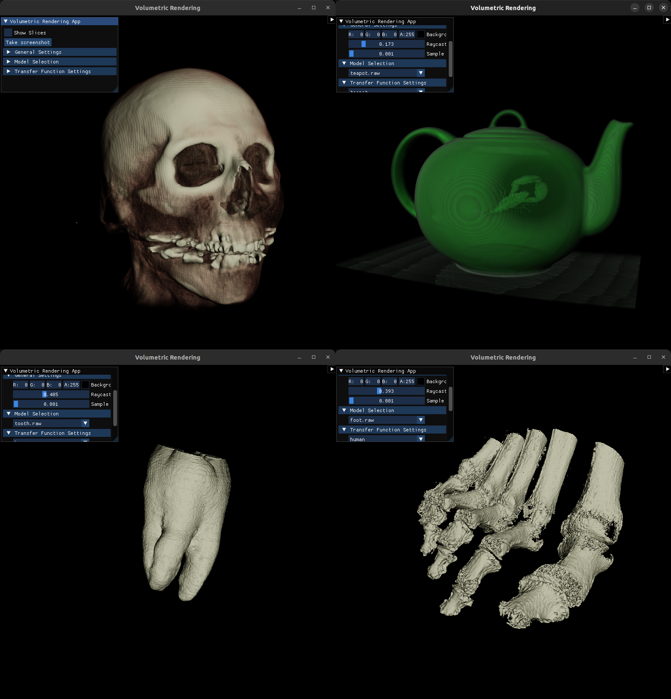
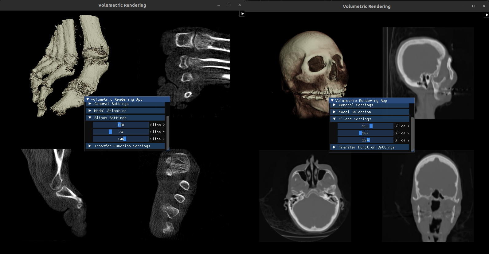

# Rendering of volumetric data
This application is a solution for rendering small volumetric datasets using C++ and OpenGL. It implements a Single-pass volumetric raycasting introduced (here)[https://martinopilia.com/posts/2018/09/17/volume-raycasting.html] (and other various sources such as [this](https://github.com/jose-villegas/VolumeRendering) repository).

For further info please read the documentation file in the `doc` folder.

(Project created as part of PGPa course on BUT, FIT. 30/30pts)

## Running the program
In the repository there is a `CMakeLists.txt` file included. Please make sure that you have installed the required libraries which are:
 - [glfw](https://www.glfw.org/)
 - [GLEW](https://glew.sourceforge.net/)
 - [OpenMP](https://www.openmp.org/)

Once you have installed all the needed dependencies, please also download the sample data from [here](https://drive.google.com/drive/folders/17A1xH5diy-YPVWoI7eJ11RLReLKQFzEv?usp=share_link). Place **all** of these into the `res/textures/` directory.

If you have done so, it is as easy as:
```
cd path/to/repo
mkdir build && cd build
cmake ..
make
./VolumeRendering
```

## Previews
Previews from the solution:




